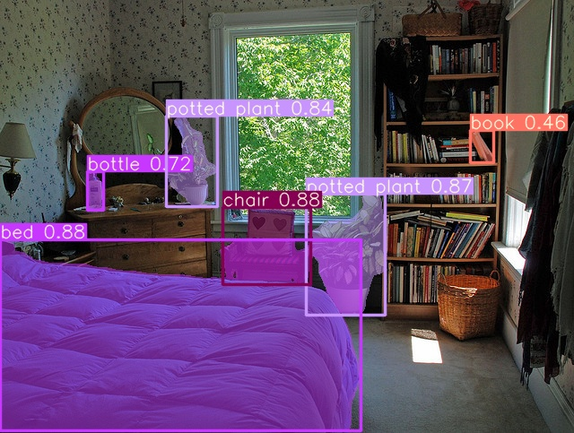
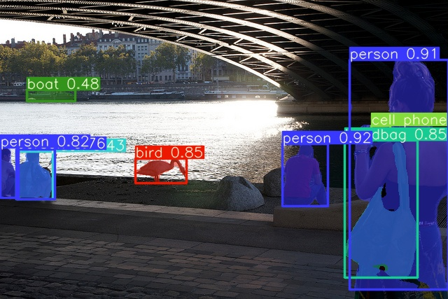
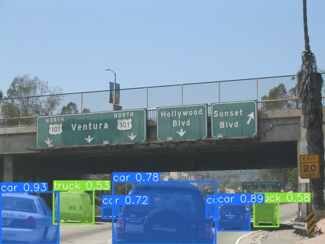
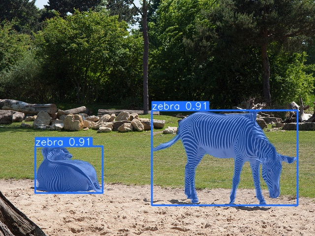
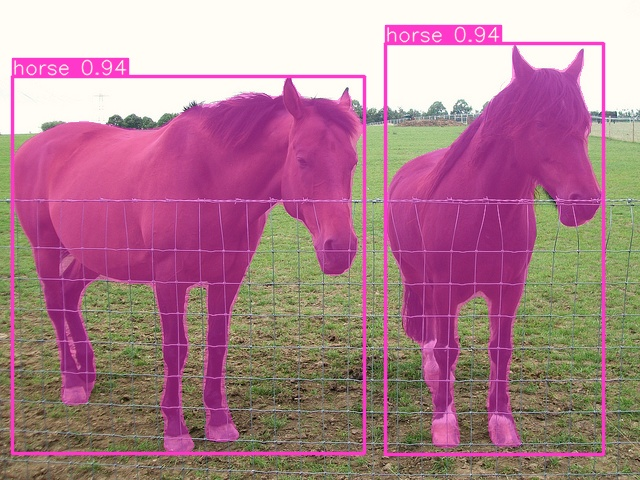

## 📖README
- This repo is plan for instance segmentation based on yolov5 and yolact.
- The weights in releases support detection only, it's just suit this repo.
- This repo is experimental, it's semi-finished for now.
- I wrote some scripts to export `yolov5` through `tensorrtx` which I don't use anymore, so maybe they won't work.
- mAP<sub>mask</sub> seems too low compared with mAP<sub>bbox</sub>, cause this is a naive version, I haven't do many experiments yet.
- The weights(`s`, `m`, `l`) will releases when I finish my `yolov5l` training.

## ✍TODO
- [ ] add more backbone
- [ ] dataset
  - [ ] yolo
  - [ ] coco
- [X] assigner
- [ ] head
  - [ ] loss
  - [ ] segment head
  - [ ] keypoint head
- [ ] trainer
- [ ] eval(coco)
- [ ] hook
- [ ] tensorrt export

## 🖼️Results
<div align=center>

</div>
<div align=center>

</div>
<div align=center>

</div>
<div align=center>

</div>
<div align=center>

</div>


## 🪵Models
| Model         | size<br><sup>(pixels) | mAP<sup>val<br>bbox | mAP<sup>val<br>mask | Speed<br><sup>RTX2070 b1<br>(ms) | params<br><sup>(M) | FLOPs<br><sup>@640 (B) |
|---------------|-----------------------|---------------------|---------------------|----------------------------------|--------------------|------------------------|
| `yolov5s-seg` | 640                   | 38                  | 28.1                | 8.8ms                            | 7.4M               | 25.9                   |
| `yolov5m-seg` | 640                   | 45.2                | 33.1                | 11.2ms                           | 22M                | 71.1                   |

## 🎨Quick Start

<details open>
<summary>Installation</summary>

Clone repo and install [requirements.txt](https://github.com/Laughing-q/yolov5-q/blob/master/requirements.txt) in a
**Python>=3.7.0** environment, including**PyTorch>=1.7.1**.

```shell
pip install git+https://github.com/Laughing-q/lqcv.git
git clone https://github.com/Laughing-q/yolov5-q.git
cd yolov5-q
pip install -r requirements.txt
pip install -e .
```

</details>


<details open>
<summary>Training</summary>

Prepare your objection labels like [yolov5](https://github.com/ultralytics/yolov5/wiki/Train-Custom-Data) to train objection:
- training objection
```shell
python tools/train.py --data ./data/seg/balloon.yaml --weights weights/yolov5s.pt --epochs 50 --batch-size 8
```

Prepare your mask labels like below to train instance segmentation, `xy` is the polygon point of mask:
```shell
0 x1 y1 x2 y2 x3 y3 ...
1 x1 y1 x2 y2 x3 y3 x4 y4 x5 y5...
2 x1 y1 x2 y2 x3 y3 x4 y4...
.
.
.
```
you can also check the [coco-segment](https://github.com/ultralytics/yolov5/releases/download/v1.0/coco2017labels-segments.zip) labels from official yolov5 or my test dataset [balloon](https://github.com/Laughing-q/yolov5-q/releases/download/0.1.0/balloon.zip).

- training segmentation
```shell
python tools/train.py --data ./data/seg/balloon.yaml --weights weights/yolov5s.pt --cfg ./configs/segment/yolov5s_seg.yaml --epochs 50 --batch-size 8 --mask --mask-ratio 8
```

</details>

<details open>
<summary>Evalution</summary>

- eval objection
```shell
python tools/val.py --data ./data/seg/balloon.yaml --weights weights/yolov5s.pt --epochs 50 --batch-size 8
```

- eval segmentation
```shell
python tools/val.py --data ./data/seg/balloon.yaml --weights weights/yolov5s.pt --batch-size 8 --mask
```

</details>

<details open>
<summary>Detection and Instance Segmentation</summary>

- detection
```shell
python tools/detect.py --source img/dir/video/stream --weights weights/yolov5s.pt
```

- instance segmentation
```shell
python tools/detect.py --source img/dir/video/stream --weights weights/yolov5s.pt --mask
```

</details>


## 🖌Tips
- Plot mask will occupy a lot of cuda memory, so `plots=False` when training by default, so you may need to run `tools/val.py` after training for more visualization.
- `process_mask` will save a lot of cuda memory, but get rough masks(`plots=False`).
- `process_mask_unsample` will occupy a lot of cuda memory, but get better masks(`plots=False`).
- not support `wandb` and `evolve`, cause I don't need them.
- For `tools/train.py`, just put a `--mask` option and `--cfg` option, then you can train instance segmentation.
- For `tools/val.py`, just put a `--mask` option, then you can val instance segmentation.
- For `tools/detect.py`, just put a `--mask` option, then you can do instance segmentation.

## 🍔Reference
- [https://github.com/ultralytics/yolov5](https://github.com/ultralytics/yolov5)
- [https://github.com/Megvii-BaseDetection/YOLOX](https://github.com/Megvii-BaseDetection/YOLOX)
- [https://github.com/dbolya/yolact](https://github.com/dbolya/yolact)
